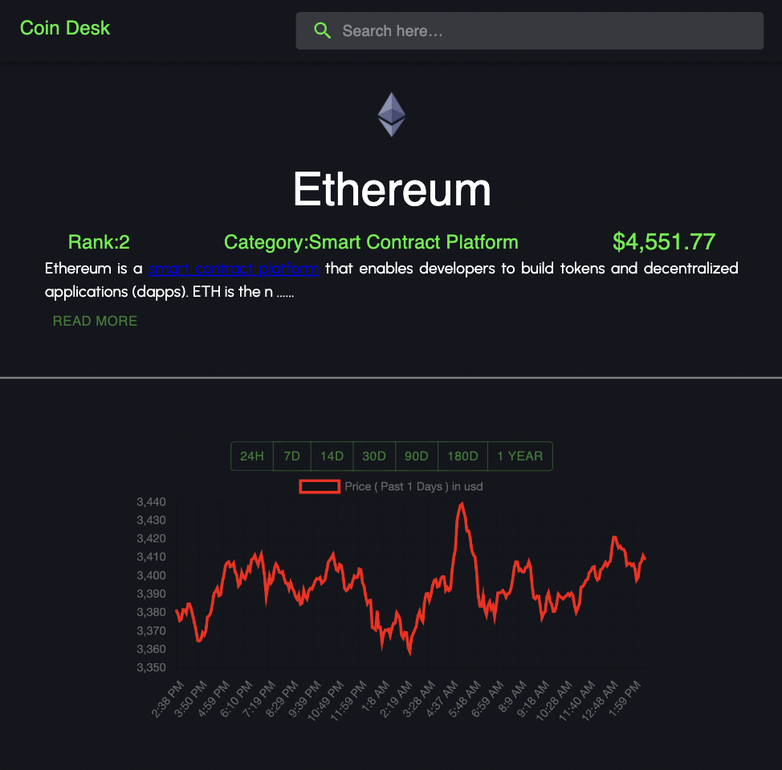
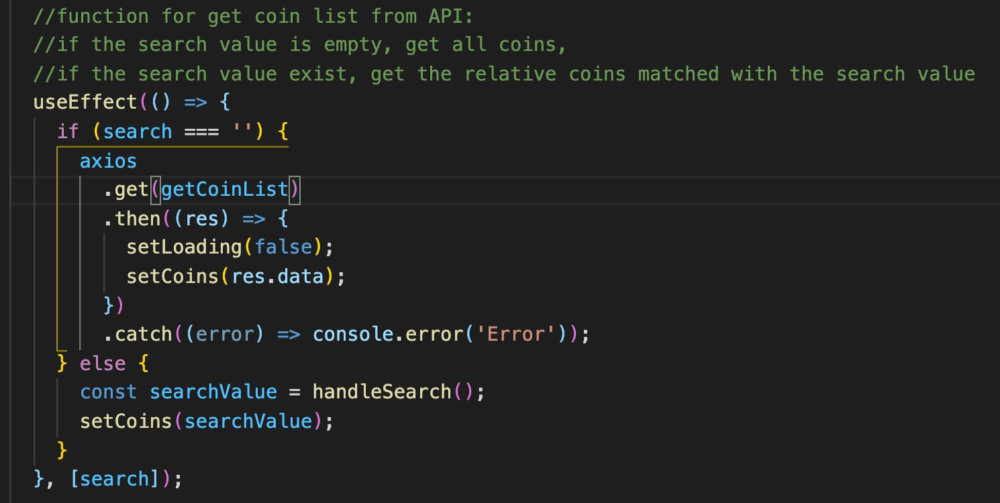
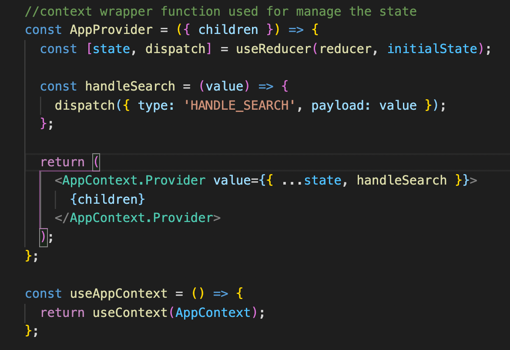
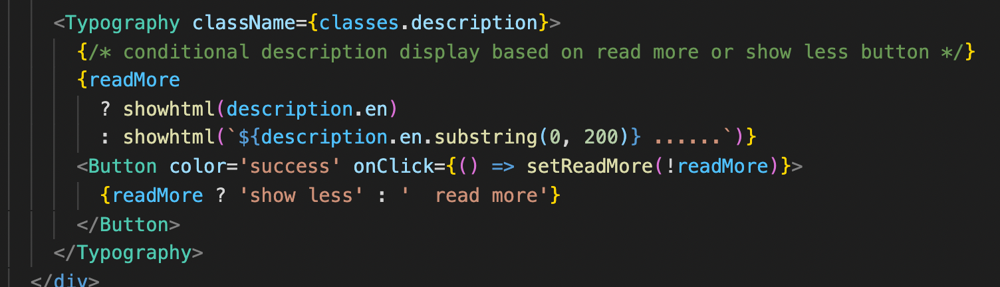

## Application URL

https://winny-crypto-coin.netlify.app/

## GitHub repo:

https://github.com/winny1212/react-crypto-coin-tracker-practice

## Application introduction

Crypto coin is a hot topic now and especially last year the whole market was so crazy. That is the main reason I choose the coins API among a list of financial products API.

## Three APIs used in this app

#### Get all coin list

https://api.coingecko.com/api/v3/coins/markets?vs_currency=usd&order=market_cap_desc&per_page=80&page=1&sparkline=false

#### Get single coin

https://api.coingecko.com/api/v3/coins/${id}

#### Get single coin historical market data

https://api.coingecko.com/api/v3/coins/${id}/market_chart?vs_currency=usd&days=${days}

## Some information about the files structure

- At this app I didn't seperate the custom styling code in a file but leave them with the its component code. As I think it maybe easier for you reviewing. But I know in the real big project, we need to seperate the styling code and relative component code.

## What it is Crypto-coin-tracker and website preview

- Homepage

  - _Coins' table_: User can view a bunch of coins' market data from the coin table
  - _Search coin_: User can search their interested coins
    

- Single coin page
  - _View single coin details_
  - _Data shows by the line chart during different time period_
    

## Some code snippet

#### Method for calling API in useEffect

#### Manage global state by context method

#### State hook

